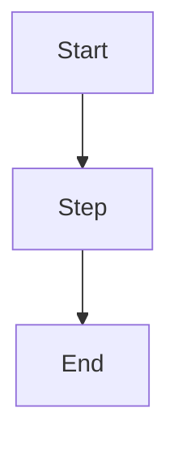

# docs/rules.md — Tight Rules (Spec + Speck Driven Development)

**Version: 0.1.0**

These rules are **STRICT / NON‑NEGOTIABLE** for all AI agents and contributors in this repo.

If any instruction conflicts:

1) System message
2) User instruction
3) `docs/rules.md`
4) `docs/spec.md`
5) `docs/specks/*.md`
6) `README.md`

If truly ambiguous — ask before acting.

---

## 0) Scope & Applicability

This repo may contain:

- Backend API only (NestJS or ASP.NET Core/.NET or other)
- Frontend only (React/Angular/Vue)
- Fullstack monorepo

Apply **only what exists**, but preserve **fail-fast test order**.

---

## 1) Top Priorities (Decision Order)

When tradeoffs exist, agents MUST prioritize in this exact order:

1) The business request is implemented (matches `docs/spec.md` + the task Speck).
2) Quality gate passed (typecheck/lint/format if enforced, tests, coverage, audits).
3) Unit tests are green and cover **100%** of:
    - lines
    - branches
    - functions  
      (applies independently to **API** and **UI** codebases if they exist)
4) Independent integration tests are green and cover **100%** of:
    - lines
    - branches
    - functions
    - classes (if applicable and measurable for the stack)  
      (applies independently to **API** and **UI** codebases if they exist)
5) Curl tests cover **all positive, negative, and security/adversarial** API responses (if API exists).
6) UI tests cover **all use cases + edge cases + negative paths + security vectors** (if UI exists), with required artifacts and baseline comparisons.
7) Security audit passes (no noticeable issue; no new high/critical findings; no obvious insecure patterns).
8) Dependencies checked (latest stable versions used; exceptions must be justified and recorded in Speck).
9) Application speed optimized (no avoidable regressions; obvious hotspots addressed).
10) Application size optimized (no avoidable bloat; bundles/images kept lean).
11) Final gate passes on **Production images** (optimized shipping artifacts): full stack + **all curl + all UI tests**.
12) CI steps are simulated and verified (local/container parity).

---

## 2) Documentation Doctrine (ALL docs live in `./docs`)

### 2.1 Required documentation files

All documentation MUST be stored under `./docs`.

Mandatory documents:

- `docs/spec.md` (**main spec; business truth; replaces `functional.md` and `task.md`**)
- `docs/development-manual.md`
- `docs/installation-manual.md`
- `docs/configuration-manual.md`

If deprecated docs exist (`functional.md`, `task.md`, etc.):

- treat as deprecated
- migrate content into `docs/spec.md`
- eliminate contradictions (one truth only)

### 2.2 `docs/spec.md` is the business truth

Agents MUST NOT implement behavior contradicting `docs/spec.md`.

`docs/spec.md` MUST describe:

1) What the system does
2) What the system solves (business values)
3) How the system does it (high-level architecture/flow)
4) Blocks of use cases (grouped logically)
5) Business rules/workflows list (with IDs)

### 2.3 Use case requirements (mandatory)

Each use case MUST have an ID: `UC-###`.

Each use case MUST include:

- **Summary**
- **Description**
- **Mermaid flow diagram** (mandatory)
- **Baseline screenshot(s)** reference (mandatory) so UI tests can compare expected vs actual
- Observed failure modes (validation/auth/empty/conflict messaging) when applicable

Baseline screenshots MUST live under:

- `docs/ui-baselines/UC-###/<project-name>/<step>.png`

Where `<project-name>` is the Playwright project/device+orientation (see §7.3) and `<step>` is stable:

- `01-start.png`, `02-filled.png`, `03-success.png`, `04-error-validation.png`, etc.

`docs/spec.md` MUST reference screenshots by path (relative to repo root).

### 2.4 Business rules / workflows requirements (mandatory)

Business rules and workflows MUST be listed with stable IDs:

- `BR-###` for business rules (invariants/constraints)
- `WF-###` for workflows (multi-step processes)

Use cases MUST reference applicable BR/WF IDs.

---

## 3) Mandatory Speck Driven Development (SDD)

### 3.1 Specks location + naming (mandatory)

Every task/request MUST have a Speck file:

- `docs/specks/SDD-###-short-title.md`

### 3.2 Speck audit is mandatory for EVERY task (no exceptions)

Before any code changes, the agent MUST perform a Speck audit:

1) Read `docs/spec.md`:
    - identify impacted `UC-###`
    - identify impacted `BR-###` / `WF-###`
    - identify impacted API/UI contracts and baseline screenshots
2) Determine if the request can break existing:
    - UC flows
    - BR/WF invariants
    - API status codes/response shapes/messages
    - UI states/layout/baseline screenshots
3) Create/update the Speck:
    - include scope + non-goals
    - include acceptance criteria `AC-1..AC-n`
    - include **security acceptance criteria** `SEC-1..SEC-n` (mandatory — identify attack vectors relevant to the change)
    - include failure modes + mapping (API/UI)
    - include a **Test Matrix** mapping each AC and SEC → required test stages
    - reference impacted `UC-###` and `BR/WF` IDs
4) If behavior changes: update `docs/spec.md` first (and baselines if UI-visible), then tests, then code.

**No silent drift:** If implementation reveals missing/incorrect requirements, update Speck (and `docs/spec.md` if
business-level)
BEFORE changing behavior in code/tests.

---

## 4) Spec Reconstruction + Spec Validity Checks

### 4.1 If `docs/spec.md` is missing: reconstruct from codebase (mandatory)

If `docs/spec.md` is missing, agents MUST reconstruct it from the codebase **before** implementing any behavior change.

Reconstruction MUST:

- create `docs/spec.md` following all rules in §2
- derive behavior from actual code (and OpenAPI/Swagger if present)
- derive UCs from routes/pages/workflows/background jobs/persistence constraints
- include Mermaid diagrams for every UC
- include baseline screenshot references for every UC:
    - if UI is runnable in docker, generate baselines via Playwright and store under `docs/ui-baselines/...`
    - if baselines cannot be generated, explicitly report what is missing and why the repo is not "done"

Reconstruction MUST NOT invent business intent not supported by code. If business value is unclear, describe value as
observable outcomes only.

### 4.2 On user request: validate `docs/spec.md` against code (mandatory behavior)

When the user asks to validate spec vs code, the agent MUST:

1) Read `docs/spec.md` and extract:
    - UC inventory (`UC-###`)
    - BR/WF inventory
    - API contracts (routes/methods/status/response shapes) if applicable
    - UI journeys + baseline screenshot references
2) Inspect the codebase (and OpenAPI if present) and build a code-derived spec
3) Generate `docs/spec-from-code.md`:
    - MUST follow the same structure/rules as `docs/spec.md`
    - MUST reflect what the system does **as implemented**
    - MUST NOT overwrite `docs/spec.md`
    - MUST NOT overwrite baseline images
4) Provide a concrete diff report (user decides):
    - include "Differences vs docs/spec.md" inside `docs/spec-from-code.md`
      OR generate `docs/spec-diff.md`
    - categorize differences:
        - missing UCs (spec-only vs code-only)
        - contract mismatches (routes/methods/status/body)
        - flow mismatches (steps/branches/messages)
        - BR/WF mismatches
        - baseline gaps/mismatches
        - auth/security mismatches

During audit, the agent MUST NOT auto-change `docs/spec.md` or code unless the user chooses:

- "spec is right, change code" OR
- "code is right, change spec" OR
- "hybrid resolution"

---

## 5) Code Quality Rules

### 5.1 Type safety (hard)

**TypeScript (if TS exists)**

- NEVER use `any`
- NEVER use casts (`as`, `<T>`) to bypass correctness
- Prefer explicit interfaces, generics, discriminated unions, exhaustive `never` checks

**C#/.NET (if C# exists)**

- Avoid `dynamic` unless unavoidable and justified by existing architecture
- No unsafe casts; use pattern matching / `TryParse` / safe conversion
- Respect nullable reference types; do not silence warnings without reason

**Violation = failed task.**

### 5.2 Maintainability limits (hard)

Applies to all newly written/modified code:

- Max line length: **120 chars**
- Max method/function: **30 non-empty, non-comment lines**
- Max class/type: **500 non-empty, non-comment lines**

If touched code already violates limits:

- do not refactor unrelated code for style
- prefer minimal extraction with identical behavior
- if change cannot be done without exceeding limits: request explicit approval

### 5.3 Implementation quality

- Provide complete working code (no placeholders)
- No TODOs, dead code, or commented-out logic
- Keep changes minimal and scope-limited
- Follow existing conventions/architecture
- Do not reduce security, validation, or observability
- **No resource leaks:** all connections, streams, file handles, timers, and event listeners MUST be properly closed/disposed (use `try/finally`, `using`, `defer`, or framework-appropriate patterns)

---

## 6) Testing Doctrine (Container-first, Fail-fast)

### 6.1 Test change policy (hard)

- Adding tests is always allowed and often required
- Modifying/removing existing tests is FORBIDDEN without explicit user approval  
  (until approved: add new tests reflecting new behavior)

### 6.2 Container-first execution (hard)

- ALL tests MUST run in Docker containers (local + CI)
- No host dependencies/manual setup
- Required infra (DB/cache/queue/object storage) MUST be dockerized (via `docker-compose.yml`)

### 6.3 Ephemeral DB rule for test suites (hard)

For any DB-backed integration/curl/UI/production suite:

- DB starts empty every run
- No persisted volumes (no bind mounts, no reused named volumes)
- Must include readiness gates (healthcheck or explicit wait)
- Retries must be bounded (max attempts + max wait)
- Migrations/seeds run only after readiness confirmed
- Tests MUST be order-independent (no shared state assumptions)

(Unit tests should not need DB. If they do, they are DB-backed and must follow this rule.)

### 6.4 Positive + negative + security testing (hard)

Every test suite (unit, integration, curl, UI) MUST cover:

- **Positive paths:** expected inputs produce expected outputs/states
- **Negative paths:** invalid/missing/malformed inputs are rejected with correct errors
- **Security / adversarial paths** (mandatory, not optional):
    - injection attacks (SQL injection, NoSQL injection, XSS, command injection, LDAP injection)
    - authentication bypass attempts (missing/expired/forged tokens, tampered JWTs, replay attacks)
    - authorization escalation (accessing other users' resources, privilege escalation, IDOR)
    - input abuse (oversized payloads, deeply nested JSON, boundary values, null bytes, unicode edge cases)
    - rate limiting / abuse (if applicable: brute-force login, enumeration attacks)
    - header manipulation (host header injection, missing security headers, CORS abuse)
    - path traversal / directory traversal attempts
    - mass assignment / parameter pollution (sending unexpected fields to mutate protected attributes)
    - **memory leaks** (unclosed connections/streams/handles, unbounded caches, event listener accumulation, unreleased resources under repeated load)

Security tests MUST be **explicitly labeled** in test titles (e.g., `test('[SEC][UC-005] SQL injection in search param', ...)`).

If a security vector is not applicable to a specific route/component, document why in the Speck.

### 6.5 Fail-fast stages (mandatory)

Stage definitions:

1) **Unit** (positive + negative + security)
2) **Integration** (positive + negative + security)
3) **Curl (Dev/Runtime images)** (positive + negative + security)
4) **Base UI (Playwright, Dev/Runtime images)**
5) **UI (Playwright headless Chromium, Dev/Runtime images)** (positive + negative + security)
6) **Curl (Production optimized API image)** — 100% API coverage (if API exists)
7) **Production (Optimized fullstack images)** — FULL stack + **ALL curl + ALL UI tests**

Fail-fast order:
1 → 2 → 3 → 4 → 5 → 6 → 7

CI MUST stop at the first failing stage.

Security tests MUST NOT be isolated into a separate late stage — they run **within** each stage alongside functional tests.

---

## 7) Coverage + Curl + UI Requirements

### 7.1 Coverage requirements (hard)

Applies independently to **API** and **UI** codebases when they exist:

- Unit coverage: **100%** lines + branches + functions
- Integration coverage: **100%** lines + branches + functions (+ classes if applicable/measurable)

No "gaming" with meaningless assertions.

Coverage MUST include positive, negative, AND security/adversarial cases (see §6.4).
A suite that reaches 100% coverage with only happy-path assertions is **non-compliant**.

### 7.2 Curl testing requirements (if API exists)

Curl tests MUST:

- cover **100%** of public routes (inventory source priority: OpenAPI → `docs/spec.md` → route inventory file)
- assert status code AND response body shape/content
- verify primary business outcome (DB change, emitted event, returned data correctness)
- cover **all positive and negative outcomes** per route, when applicable:
    - success
    - validation errors (400/422)
    - auth failures (401/403)
    - not-found (404)
    - conflicts (409)
    - other documented errors from `docs/spec.md` and Specks
- cover **security / adversarial scenarios** per route (see §6.4), including at minimum:
    - injection payloads in every user-controlled input (query params, body fields, headers, path params)
    - auth bypass attempts (missing token, expired token, token for wrong user/role)
    - IDOR attempts (accessing/modifying resources owned by another user)
    - mass assignment attempts (sending admin-only / protected fields in request body)
    - oversized / malformed payloads (verify graceful rejection, not crash)
    - **memory leak indicators** under repeated requests (if measurable: monitor RSS/heap growth across batch runs; no unbounded growth)

Stage requirements:

- Stage 3: curl against Dev/Runtime images (fail-fast)
- Stage 6: curl suite MUST pass against **optimized Production API image**
- Stage 7: curl suite MUST pass again as part of full optimized stack

### 7.3 UI testing requirements (if UI exists) — mandatory device matrix

UI tests are obligatory.

**Device matrix (mandatory):**

- Desktop
- Tablet portrait
- Tablet landscape
- Mobile portrait + landscape for:
    - last 3 iPhones (ALL models in those generations)
    - last 3 Google Pixels (ALL models in those generations)
    - last 3 Samsung flagships (ALL models in those generations)

The exact device list MUST be defined and maintained in:

- `docs/configuration-manual.md` (Device Matrix section)

Playwright MUST implement the matrix as **projects** (no manual resizing/clicking).

**Every UI test MUST run across ALL projects** unless explicitly scoped and approved.

### 7.4 UI test mapping + baselines (hard)

- Every UI test MUST map to at least one use case `UC-###`
- **Every `UC-###` MUST be covered by at least one Playwright UI test with recorded video** — no UC without a video artifact
- Test titles MUST include UC id(s), e.g. `test('[UC-012] ...', ...)`
- Every UI test MUST:
    - do real interactions (click/type/submit/scroll)
    - prove elements are interactable (not only visible)
    - produce artifacts: step screenshots + video (always)
    - compare screenshots against baselines for its UC steps and for each Playwright project
    - include **negative path** tests (invalid input, empty submissions, boundary values)
    - include **security/adversarial** tests where applicable:
        - XSS payloads in input fields (verify sanitization/escaping)
        - script injection via URL params / hash fragments
        - UI-level auth bypass (direct navigation to protected routes without session)
        - client-side privilege escalation (hidden admin UI elements accessible via DOM manipulation)
        - **memory leaks** in the browser (detached DOM nodes, unsubscribed observables/listeners, growing heap on repeated navigation)

**Human-like interaction speed (hard):**

Tests MUST simulate realistic human interaction timing — NOT instant machine-speed actions:

- **Typing:** 2–3 characters per second (300–500ms delay between keystrokes). Use Playwright's `type()` with `delay` option, NOT `fill()`
- **Post-navigation wait:** wait **at least 1 second** after each page load / route change before interacting (simulates user reading/orienting)
- **Click pause:** wait **300–500ms** before and after each click action
- **Form field transitions:** wait **200–400ms** between moving to the next field (simulates tabbing / mouse move)
- **Post-submit wait:** wait **1–2 seconds** after form submission before asserting results (simulates user watching for feedback)
- **Scroll pause:** wait **500ms–1s** after scrolling before interacting with newly visible content

These delays MUST be implemented via a shared test utility (e.g., `humanType()`, `humanClick()`, `waitForHuman()`) — NOT ad-hoc `sleep()` calls scattered through tests.

**Mouse cursor visibility in videos (hard):**

- Test videos MUST show where mouse clicks occur — the viewer MUST be able to follow the cursor
- Use Playwright's built-in cursor visualization or inject a custom cursor overlay (CSS/JS) that:
    - shows the cursor position at all times
    - highlights click events visually (e.g., ripple, dot, or flash on click)
- If Playwright does not natively render cursor in video: inject a helper script into the page under test that tracks `mousemove`/`click` and renders a visible indicator

**Video resolution (hard):**

- Minimum video resolution: **1920×1080 (Full HD)** — preferred
- Acceptable fallback: **1280×720 (HD)** — only if Full HD causes stability/performance issues (must justify in Speck)
- Playwright `video.size` MUST be explicitly configured — do NOT rely on defaults
- For mobile/tablet projects: video resolution MUST match the device viewport (but never below 720p height)

Baseline comparison rule:

- For each `UC-###` test step, the test MUST compare screenshot to:
    - `docs/ui-baselines/UC-###/<project-name>/<step>.png`

### 7.5 Required artifacts (hard)

Playwright runs MUST produce:

- HTML report (always)
- screenshots for major stages (always)
- video per test (always, **Full HD 1920×1080** preferred, minimum HD 1280×720)
- on failure: screenshots + video (mandatory) and traces strongly recommended

Videos MUST show cursor position and click events (see §7.4).

Artifacts must be written to predictable directories:

- `playwright-report/`
- `test-results/`

### 7.6 Mandatory "Customer Demo" test (hard)

There MUST be one final UI test that serves as a customer demo covering ALL use cases:

- runs last within the UI suite
- includes all relevant UC IDs in the title, e.g. `[DEMO][UC-001][UC-002] ...`
- runs across the full device matrix
- uses human-like interaction speed (§7.4) — this video is the primary demo artifact
- produces the same artifacts (screenshots + video at Full HD resolution with visible cursor)

---

## 8) Dev/Build Infrastructure Rules

### 8.1 One-command dev mode (mandatory for client-server systems)

If this is a client-server system, repo MUST include a root `docker-compose.yml` such that:

- `docker compose up --build` brings up ALL services
- services are seeded and system is ready to use with a single command
- seeding is idempotent (safe to run multiple times)
- no manual steps required

**Port management (hard):**

- Only **required** ports MUST be exposed (no debug ports, no unnecessary internal ports)
- All exposed ports MUST be configurable via `.env` (e.g., `API_PORT=3000`, `UI_PORT=4200`, `DB_PORT=5432`)
- The agent MAY NOT be the only process running on the host — port conflicts are expected
- If a port-in-use error is detected, the agent MUST:
    1) identify the conflicting port from the error
    2) select an available alternative port
    3) update `.env` accordingly
    4) retry — do NOT ask the user to resolve port conflicts manually
- `docker-compose.yml` MUST reference port variables from `.env` (e.g., `"${API_PORT}:3000"`)
- `.env` MUST ship with safe defaults, but switching ports MUST NOT require any code/config change beyond `.env`

### 8.2 Dev data + temp dirs (hard)

- Dev volumes MUST use `./.dev-data/`
    - deleting `./.dev-data/` MUST reset the system
- Build-time temporary files MUST use `./.dev-temp/` wherever possible
    - safe to delete anytime
- No other ad-hoc temp directories unless explicitly approved

Tests MUST NOT rely on `./.dev-data/` (tests must be ephemeral).

### 8.3 Container image selection policy (hard)

All Dockerfiles MUST use **multi-stage builds** separating build dependencies from runtime.

**Base image selection — mandatory priority order for production stages:**

1) **Distroless** (e.g., `gcr.io/distroless/nodejs-debian12`, `gcr.io/distroless/cc-debian12`) — preferred
2) **Alpine bare** (e.g., `alpine:3.x`) — if distroless is not viable for the stack
3) **`xx-alpine` variant** (e.g., `node:22-alpine`, `nginx:alpine`, `postgres:16-alpine`) — last resort

If a lower-priority base is chosen, the Speck MUST document **why** the higher-priority option was not viable.

**Base image version policy:**

- ALWAYS use the **latest LTS** version of the base image (e.g., `node:22` not `node:20` when 22 is current LTS)
- ALWAYS pin to a specific minor/patch tag for reproducibility (e.g., `node:22.14-alpine`, not `node:latest`)
- When a new LTS is released, existing images SHOULD be updated in the next task that touches the Dockerfile

**Runtime hardening (mandatory):**

- Production containers MUST run as a **non-root user**
- Production images MUST define a `HEALTHCHECK` instruction
- A `.dockerignore` file MUST exist at the repo root (or per-service if monorepo)

### 8.4 UI framework preference (when building from scratch)

If building a UI from scratch, the preferred stack is:

- **Latest Angular** (latest LTS)
- **Angular Material** (latest compatible)
- **Zoneless** change detection (signals-based, no Zone.js)
- **Standalone components** (no NgModules)

**Runtime configuration (hard — applies to ALL UI frameworks, not just Angular):**

- The UI MUST load all environment-dependent URLs and settings from a **`settings.json`** file served from the same level as `index.html` (web root)
- `settings.json` MUST contain at minimum: API base URL, auth endpoints, and any other environment-specific values
- The app MUST fetch `settings.json` at startup (e.g., `APP_INITIALIZER` in Angular, or equivalent in other frameworks) **before** any service/component uses those values
- **Rebuilding the UI for different environments is FORBIDDEN** — switching environments MUST only require replacing `settings.json` (or mounting a different one in Docker)
- `docker-compose.yml` / Dockerfile MUST support mounting or overriding `settings.json` at deploy time
- Default `settings.json` MUST ship with safe local-dev values

**Server-generated `settings.json` (preferred):**

- If the backend is NestJS, ASP.NET Core, or similar — the server SHOULD dynamically generate and serve `settings.json` at runtime from its own environment/configuration (e.g., `appsettings.json`, `.env`, config service)
- This eliminates the need to mount or replace `settings.json` per environment — the server derives it from its own config, single source of truth
- The endpoint (e.g., `GET /settings.json` or served as a static file rewritten at container startup) MUST be unauthenticated and cacheable
- If server-generated `settings.json` is used, the static fallback file MUST still exist for local dev without the server (e.g., `ng serve` / standalone UI dev mode)

### 8.5 Reverse proxy support (hard)

The application MUST work correctly behind a reverse proxy (nginx, Traefik, or similar). This is mandatory regardless of whether a proxy is included in the repo's `docker-compose.yml`.

**Requirements:**

- All services MUST respect `X-Forwarded-For`, `X-Forwarded-Proto`, `X-Forwarded-Host`, and `X-Forwarded-Prefix` headers
- The API MUST NOT generate absolute URLs with hardcoded host/port — use relative URLs or derive base URL from forwarded headers / configuration
- The UI MUST NOT assume it is served from `/` — base href MUST be configurable (e.g., via `settings.json` or `<base href>` injection at serve time)
- WebSocket endpoints (if any) MUST support proxied connections (correct `Upgrade` handling)
- CORS configuration MUST be environment-driven (via `.env` / config), not hardcoded origins
- Auth callbacks / redirect URIs MUST use the externally visible URL (from forwarded headers or config), not the internal container address
- Health check endpoints MUST remain accessible to the proxy without auth

**If the repo includes a reverse proxy in `docker-compose.yml`:**

- Prefer **Traefik** (label-based, zero-config reload) or **nginx** (config file)
- Proxy config MUST be environment-driven (domains, paths, TLS settings from `.env`)
- TLS termination at the proxy is recommended; backend services communicate over plain HTTP internally

**If the repo does NOT include a proxy:**

- `docs/installation-manual.md` MUST document the expected proxy setup (headers, paths, TLS) so ops can configure nginx/Traefik/cloud LB correctly

---

## 9) Security, Dependencies, Performance, Size, CI Simulation

### 9.1 Security audit (mandatory every task)

Agents MUST run relevant security checks and ensure:

- no new high/critical vulnerabilities
- no obvious insecure patterns (auth bypass, injection risks, unsafe deserialization, etc.)

If pre-existing issues exist:

- report them explicitly
- do not hide/silence them

### 9.2 Dependencies (mandatory every task)

- Base images MUST use the **latest LTS** version available (see §8.3).
- New dependencies MUST use the **latest stable** version.
- Existing dependencies SHOULD be updated to latest stable if safe and within scope.
- If not updating, the Speck MUST record:
    - what is outdated
    - why it wasn't updated
    - recommended upgrade path

### 9.3 Speed and size optimization (mandatory)

- No avoidable performance regressions.
- No avoidable bundle/image bloat.
- Production images MUST follow the §8.3 priority order to minimize attack surface and size.
- If budgets are not defined, add them to `docs/configuration-manual.md` and enforce them via checks where possible.

### 9.4 CI simulation (mandatory)

Agents MUST simulate CI locally (container-first) before declaring "done".
Repo SHOULD provide a single command (e.g., `make ci` or `./scripts/ci.sh`) running:

- typecheck/lint (if applicable)
- unit → integration → curl → UI → production gates (fail-fast)
- production image build
- security/dependency checks

---

## 10) Forbidden Actions (Hard)

- Breaking API changes without explicit approval
- Changing env vars/secrets without explicit approval
- Hardcoding ports in `docker-compose.yml` (MUST use `.env` variables)
- Building environment-specific UI artifacts (MUST use runtime `settings.json`)
- Hardcoding CORS origins, base URLs, or redirect URIs (MUST be config-driven for reverse proxy support)
- Modifying CI/CD unless explicitly requested
- Skipping tests, lowering coverage thresholds, disabling reporting
- Ignoring failing tests
- Introducing flaky tests
- Direct DB mutation outside migrations/seeds used by the app
- Network access outside test scope

---

## 11) "Done" Definition (Repo Deliverables)

Repo is "done" only if it contains:

Docs (all under `./docs`):

- `docs/spec.md`
- `docs/development-manual.md`
- `docs/installation-manual.md`
- `docs/configuration-manual.md`
- `docs/specks/` (Specks per task)
- `docs/ui-baselines/` (baseline screenshots per UC and per device project)

Runtime/Infra:

- root `docker-compose.yml` (one-command dev mode, seeded)
- `.env` with safe local defaults (no real secrets); all exposed ports configurable
- `.dockerignore` at repo root (or per-service)
- `settings.json` for UI runtime config (if UI exists) — no rebuild needed per environment; prefer server-generated
- Reverse proxy support verified (§8.5) or documented in `docs/installation-manual.md`
- temp conventions honored:
    - `./.dev-data/` for dev volumes
    - `./.dev-temp/` for build temp
- Production images follow §8.3 image selection policy

Testing:

- All stages pass in fail-fast order
- Unit coverage 100% (API + UI where applicable)
- Integration coverage 100% (API + UI where applicable)
- Curl tests: 100% route coverage + positive/negative outcomes + security/adversarial cases (if API exists)
- UI tests: all UCs + edge cases + negative paths + security tests + device matrix + demo test
- Every UC covered by at least one Playwright test with recorded video (Full HD, visible cursor, human-like speed)
- Security/adversarial tests present at every applicable stage (labeled `[SEC]`)
- Playwright configured for HTML report + screenshots + videos (Full HD, cursor visible)

---

## Appendix A — Minimal Use Case Template (for `docs/spec.md`)

### UC-###

**Summary:**  
**Description:**  
**Related BR/WF:** BR-###, WF-###

**Flow (Mermaid):**

**Baseline screenshots (per Playwright project):**

- `docs/ui-baselines/UC-###/<project-name>/01-start.png`
- `docs/ui-baselines/UC-###/<project-name>/02-filled.png`
- `docs/ui-baselines/UC-###/<project-name>/03-success.png`

**Playwright video:** mandatory — at least one UI test with recorded video MUST cover this UC.

**Failure modes (user-visible):**

- Validation: ...
- Auth: ...
- Empty state: ...
- Conflict: ...

---

## Appendix B — Minimal Speck Template (for `docs/specks/SDD-###-*.md`)

# SDD-### — Title

**Impacted UCs:** UC-###  
**Impacted BR/WF:** BR-### / WF-###

## Scope / Non-goals

...

## Acceptance Criteria

- AC-1: ...
- AC-2: ...

## Security Acceptance Criteria (mandatory)

- SEC-1: ... (e.g., injection payloads rejected with 400, not executed)
- SEC-2: ... (e.g., IDOR attempts return 403/404, not other user's data)
- SEC-3: ... (e.g., no memory leak under repeated load — heap growth stays bounded)

## Failure Modes / Error Mapping

...

## Test Matrix (mandatory)

| AC    | Unit | Integration | Curl Dev | Base UI | UI | Curl Prod API | Prod Fullstack |
|-------|------|-------------|----------|---------|----|---------------|----------------|
| AC-1  | ✅    | ✅           | ✅        | ✅       | ✅  | ✅             | ✅              |
| AC-2  | ✅    | ✅           | ✅        | ⬜       | ⬜  | ✅             | ✅              |
| SEC-1 | ✅    | ✅           | ✅        | ⬜       | ✅  | ✅             | ✅              |

Notes:

- "✅" means meaningful assertions (status + body + outcome; UI interaction + baseline compare).
- Every AC MUST have positive + negative test cases.
- `SEC-*` rows document which security/adversarial vectors are tested at each stage (see §6.4).
