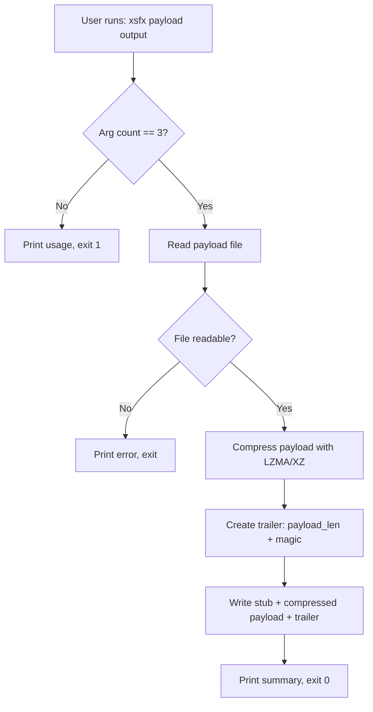
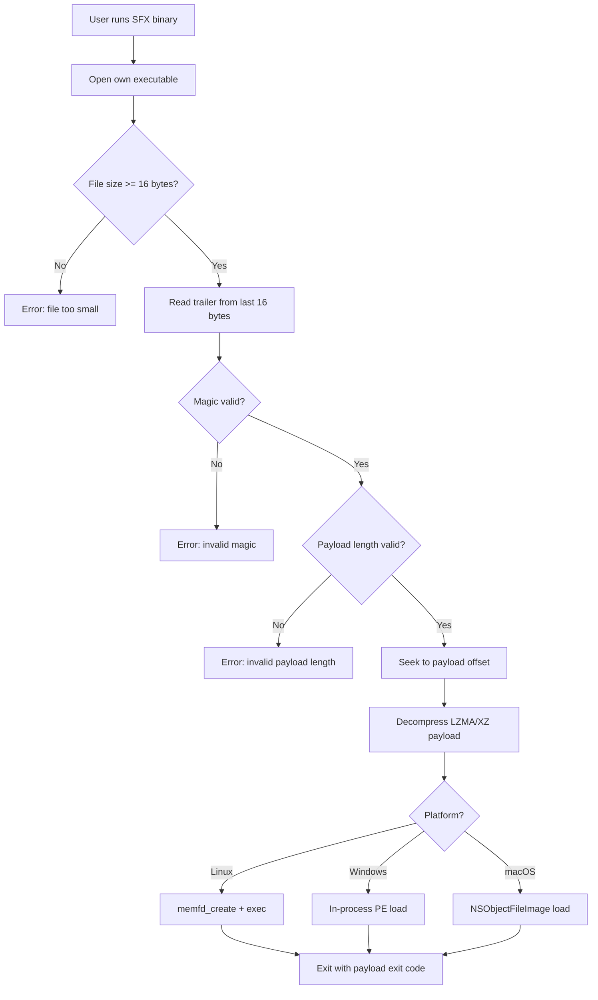
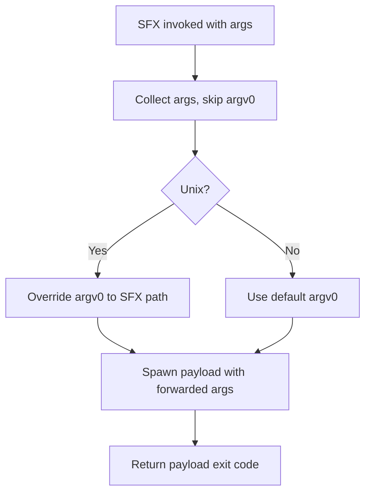

# xsfx -- Specification

**Version:** 0.1.0

## 1. What the System Does

xsfx is a self-extracting executable (SFX) packer written in Rust. It compresses a
payload binary using LZMA/XZ and bundles it with a small per-platform stub. The
resulting SFX executable decompresses and runs the payload at runtime.

## 2. What the System Solves (Business Values)

- **Single-binary distribution:** Combine a stub and payload into one executable.
- **Cross-platform:** Supports macOS, Linux, and Windows (x64 and ARM64).
- **.NET compatibility:** Does not modify PE headers, unlike UPX.
- **Minimal runtime dependencies:** Stub is pure Rust (only libc for Linux memfd).
- **Fileless execution on Linux:** Uses `memfd_create` for in-memory execution.

## 3. How the System Does It (Architecture)

### 3.1 Components

| Component | Binary    | Description                                        |
|-----------|-----------|----------------------------------------------------|
| Packer    | `xsfx`    | CLI: reads payload, compresses, produces SFX       |
| Stub      | `stub`    | Embedded runtime: extracts and executes payload     |
| Library   | `libxsfx` | Shared types (Trailer), compress, decompress funcs |

### 3.2 SFX Binary Format

```text
+------------------------+
| Stub binary            |  (embedded at build time via include_bytes!)
+------------------------+
| Compressed payload     |  (LZMA/XZ stream)
+------------------------+
| Trailer (16 bytes)     |  payload_len (u64 LE) + magic (u64 LE)
+------------------------+
```

### 3.3 Build-time Embedding (Multi-Stub Catalog)

A `build.rs` script compiles stubs for each target platform and generates a
`stub_catalog.rs` containing `include_bytes!` for each. The packer embeds all
stubs and selects the right one at pack time via `--target <triple>`.
Each packer binary can produce SFX executables for any embedded target.

---

## 4. Use Cases

### UC-001: Pack an Executable

**Summary:** User packs a payload binary into a self-extracting executable.

**Description:** The user invokes `xsfx <payload_path> <output_sfx> [--target <triple>]`.
The packer reads the payload, compresses it with LZMA/XZ, selects the stub for the
requested target from its embedded catalog, prepends the stub, appends a 16-byte
trailer, and writes the SFX to the output path.

**Related BR/WF:** BR-001, BR-002, BR-003, BR-004, WF-001

**Flow (Mermaid):**



**Baseline screenshots:** N/A (CLI tool, no UI)

**Failure modes (user-visible):**

- Wrong argument count: prints usage to stderr, exits 1
- Payload unreadable: prints error with path, exits with I/O error
- Output not writable: prints error with path, exits with I/O error

---

### UC-002: Execute a Packed SFX

**Summary:** A packed SFX binary self-extracts and runs its embedded payload.

**Description:** The stub reads the 16-byte trailer from the end of its own
executable. It validates the magic marker, reads the compressed payload, decompresses
it, and executes it in-memory using a platform-specific strategy: memfd_create on
Linux, in-process PE loading on Windows, NSCreateObjectFileImageFromMemory on macOS.
No temp files are used on any platform.

**Related BR/WF:** BR-001, BR-002, BR-005, BR-006, BR-008, BR-009, BR-010, BR-011,
BR-012, WF-002

**Flow (Mermaid):**



**Baseline screenshots:** N/A (CLI tool, no UI)

**Failure modes (user-visible):**

- File too small: "File too small to contain trailer"
- Invalid magic: "Invalid SFX magic marker"
- Invalid payload length: "Invalid payload length in trailer"
- Decompression failure: LZMA error
- Linux memfd failure: OS error from memfd_create
- Windows PE load failure: invalid PE / missing DLL / import resolution error
- macOS Mach-O load failure: invalid Mach-O / link failure / symbol not found

---

### UC-003: Forward CLI Arguments

**Summary:** CLI arguments passed to the SFX are forwarded to the payload.

**Description:** All arguments except argv[0] are forwarded. On Unix, argv[0] is
overridden to match the SFX path via `CommandExt::arg0`.

**Related BR/WF:** BR-008, BR-009, WF-002

**Flow (Mermaid):**



**Baseline screenshots:** N/A (CLI tool, no UI)

**Failure modes (user-visible):**

- Payload fails to start: OS error

---

## 5. Business Rules

### BR-001: SFX Binary Format

The SFX binary MUST be: `[stub][compressed payload][trailer]`. The trailer is always
the last 16 bytes.

### BR-002: Trailer Format

Exactly 16 bytes: `payload_len` (u64 LE) + `magic` (u64 LE). Magic MUST be
`0x5346584C5A4D4121` ("SFXLZMA!").

### BR-003: Compression Format

Payloads MUST use XZ/LZMA format, decompressible by lzma-rs `xz_decompress`.

### BR-004: Compression Implementation Selection

With `native-compress` feature: use liblzma via xz2 with ultra compression
(LZMA2 extreme preset 9, x86 BCJ filter, 64 MiB dictionary, BinaryTree4,
nice_len=273). Without: use pure-Rust lzma-rs (standard settings).

### BR-005: Decompression Implementation

The stub MUST always use pure-Rust lzma-rs for decompression (zero native deps).

### BR-006: Linux In-Memory Execution

On Linux, the stub MUST use `memfd_create` (MFD_CLOEXEC) for in-memory execution.
No temp file fallback.

### BR-007: Reserved

(Removed -- temp files eliminated on all platforms.)

### BR-008: Argument Forwarding

All CLI args except argv[0] MUST be forwarded to the payload.

### BR-009: argv[0] Preservation

On Unix, argv[0] MUST be overridden to the SFX path via `CommandExt::arg0`.

### BR-010: Static Linking Policy

All stub binaries MUST be statically linked:
- Linux: musl libc (`x86_64-unknown-linux-musl`)
- Windows: CRT static (`-C target-feature=+crt-static`)
- macOS: system frameworks (statically linked by default on macOS)

### BR-011: Windows In-Memory PE Execution

On Windows, the stub MUST load the PE payload in-process: parse PE headers,
allocate memory via VirtualAlloc, map sections, process relocations, resolve
imports via LoadLibraryA/GetProcAddress, set section protections, and call the
entry point. No temp files, no child processes.

### BR-012: macOS In-Memory Mach-O Execution

On macOS, the stub MUST load the Mach-O payload via
NSCreateObjectFileImageFromMemory: patch MH_EXECUTE to MH_BUNDLE, create object
file image, link module, look up `_main` symbol, and call it. No temp files.

### BR-013: Stub Size Budget

All stub binaries MUST be < 100 KB after post-build compression. The build
pipeline uses nightly Rust with `-Z build-std=std,panic_abort` and
`-Cpanic=immediate-abort` to minimize std footprint, followed by UPX `--best
--lzma` compression.

### BR-014: Ultra Payload Compression

When the `native-compress` feature is enabled, the packer MUST use LZMA2 ultra
compression: extreme preset 9, x86 BCJ pre-filter, 64 MiB dictionary (capped
to input size), BinaryTree4 match finder, nice_len=273. The stub decompressor
(pure-Rust lzma-rs) MUST be able to decompress the resulting stream.

---

## 6. Workflows

### WF-001: Packing Workflow

1. Parse CLI arguments (payload path, output path)
2. Read payload file
3. Compress payload (BR-003, BR-004)
4. Create trailer (BR-002)
5. Write stub + compressed payload + trailer (BR-001)
6. Print summary

### WF-002: Extraction/Execution Workflow

1. Determine own executable path
2. Read trailer from last 16 bytes (BR-002)
3. Validate magic marker
4. Validate payload length against file size
5. Seek to payload start
6. Decompress payload (BR-003, BR-005)
7. Execute payload (BR-006, BR-007)
8. Forward CLI arguments (BR-008, BR-009)
9. Exit with payload's exit code
